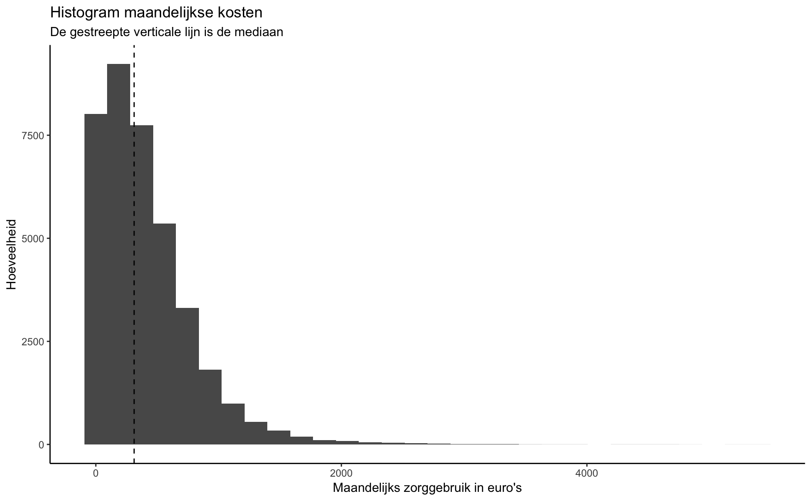
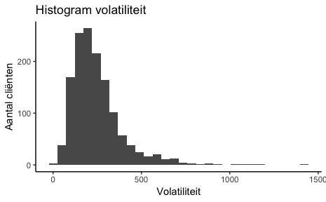
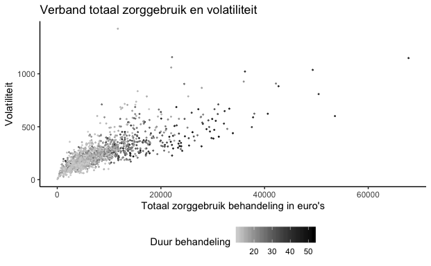

```{r setup, include=FALSE}
knitr::opts_chunk$set(echo = FALSE)
library(tidyverse)
theme_set(theme_bw())
```

Bij BuurtzorgT zien we dat sommige behandelingen zich op een volatiele manier ontwikkelen. Dit wil zeggen dat het zorggebruik sterk kan verschillen van maand tot maand. In dit blog wordt “volatiliteit” verder toegelicht.

In de sociale psychiatrie, en dus zeker ook bij BuurtzorgT, zijn behandelingen minder in beton gegoten dan in de reguliere GGZ met behandelprogramma’s. Per definitie is er in de sociale psychiatrie dus meer volatiliteit in het zorggebruik waar te nemen. Het is in het licht van doelmatige besteding van zorggeld een interessant onderwerp om nader te bekijken met behulp van statistiek. We stellen onszelf eerst een paar vragen.

1. **Is volatiliteit goed of slecht voor cliënten?**

Het hangt sterk af van de reden waarom een behandeling volatiel is. Een cliënt in crisis wil niet wachten tot hij volgens de planning aan de beurt is. Hij wil gezien worden als de nood hoog is. Dat is altijd onplanbaar qua moment en qua duur. Er zijn ook cliënten die vooral baat hebben bij structuur en juist bij planbare, voorspelbare behandelingen. De GGZ heeft zich ontwikkeld tot een sector waar behandelingen veelal zijn vormgegeven in protocollen, in planbare reeksen sessies van 45 minuten, gegeven door behandelaars met een overvolle agenda. Veel cliënten worden eens per twee weken gezien. Een afwijking van dit patroon is onwenselijk omdat te veel andere cliënten en werkzaamheden dan in de knel komen. Behandelaars hebben vaak ook een grote caseload, meestal goed afgestemd op het patroon van eens per twee weken een sessie. Het is een wat kunstmatige manier van hulpverlenen, zij het dat het voor bepaalde groepen cliënten volstaat. Zou je echter helemaal opnieuw nadenken over de inrichting van GGZ-behandelingen dan kom je bij een grote groep cliënten niet uit op dit model. Je zou een cliënt vaker kunnen zien, in langere of juist kortere sessies, op andere locaties en hierdoor meer kunnen meebewegen met de flow van de behandeling en het effect daarvan op de cliënt.

2. **Past een zekere mate van volatiliteit goed bij de manier waarop BuurtzorgT werkt?**

De behandelingen van BuurtzorgT zijn behandelingen die “van nature” ontstaan. Er is een structuur en volgordelijkheid, maar tempo en maat zijn vrij. Behandelaars hebben ook voldoende agendaruimte om deze vrijheid optimaal in te zetten. Dat geeft automatisch volatiliteit en daarmee een ander patroon dan de vermoedelijk strakkere lijnen van de behandelprogramma’s van de reguliere GGZ. Volatiliteit is een uitkomst van de werkwijze van de BuurtzorgT en de werkwijze is een vertaling van onze inhoudelijke uitgangspunten. Volatiliteit is volgens ons dus precies wat nodig is bij onze doelgroep.

3. **Wat is de optimale balans tussen plannen en volatiliteit?**

Dat verschilt per doelgroep. Optimaal is het een mix van hetgeen de behandelaar vanuit zijn professionele kijk het beste acht enerzijds en hetgeen de cliënt vraagt anderzijds. Een behandeling vraagt altijd om een structuur van planvorming, evaluatie, bijstelling, etc. Maar daar binnen zou er ruimte moeten zijn voor de meest effectieve invulling van contactmomenten. Het zou bij reguliere GGZ tot gevolg kunnen hebben dat een behandelaar een kleinere caseload krijgt wat mogelijk leidt tot een grotere wachttijd aan de voordeur. Maar dat is geen zekerheid. Je zou ook kunnen verwachten dat behandelingen sneller resultaat hebben en dat de doorstroming hoger wordt. Veel behandelingen in de GGZ duren relatief lang omdat cliënten in behandeling blijven zonder helder eindpunt. Logistiek gezien is het beter om een kleinere caseload te hebben. Dit geeft vrijwel altijd een hogere doorloopsnelheid en een kortere wachttijd aan de voordeur. 

In 2009 heb ik samen met de behandelaars op een RIAGG met een psychotherapeutische polikliniek in vrij korte tijd de wachttijd kunnen terugbrengen van 9 maanden naar 6 weken door het systematisch verkleinen van de caseload tot een rekenkundig optimum. Hierbij hielden we rekening met de verschillende fases in de behandelingen en wat dit betekende voor de contactfrequentie. Vanwege de kortere wachttijd nam vervolgens het aantal aanmeldingen weer toe, maar dat leidde niet tot een hogere wachttijd. Behandelaars hadden een net zo volle agenda, maar ervoeren meer ruimte in hun hoofd vanwege het ontbreken van de druk die een grote caseload en lange wachttijd met zich meebrengt. Ze waren ook veel beter bij met hun dossiervoering en administratie.

Terug naar volatiliteit. Als een bepaalde mate van volatiliteit de zorg ten goede komt, dan is het zaak dat behandelaars hiervoor agendaruimte houden, zodat andere cliënten niet de dupe worden van de volatiliteit van de behandeling van andere cliënten. Het heeft dus ook veel te maken met capaciteitsplanning. De sociale psychiatrie van BuurtzorgT is wat anders dan de psychotherapeutische behandelingen van een RIAGG destijds. Sociale psychiatrie vereist een kleinere caseload en een hogere volatiliteit dan een psychotherapeutische behandeling, maar in beide gevallen zou er gelegenheid moeten zijn om de volatiliteit die past bij de doelgroep te laten ontstaan.


Uiteraard bestaat er ook een risico op een te hoge mate van volatiliteit. Ook dat is weer onderdeel van het professioneel handelen. Vooral in de sociale psychiatrie is het verleidelijk voortdurend te reageren op hetgeen zich voordoet, zeker als er in praktische zin ruimte voor is. Begrenzen én het organiseren van andere “hulplijnen” is onderdeel van de behandeling bij BuurtzorgT. Zien we na verloop van tijd geen afname van volatiliteit in een behandeling dan mag je veronderstellen dat er op dit punt verbetering mogelijk is.

4. **Moeten we gaan nadenken over of (en hoe) we volatiliteit moeten beteugelen?**

Het lijkt zeker zinvol om de volatiliteit van de behandelingen onder de loep te nemen. Zoals aangegeven is het optimum geen hard gegeven, maar afhankelijk van de doelgroep en mogelijk de fase van de behandeling. Met statistiek kunnen we onderzoeken waar afwijkingen zijn op de te verwachten volatiliteit in relatie tot het beloop van behandelingen. Hiermee kunnen we waarschijnlijk uitspraken doen over de doelmatigheid van de behandelingen.

# Een introductie van volatiliteit en statistiek

Bij de toepassing van statistiek op het begrip volatiliteit kijken we eerst naar het zorggebruik per maand en hoe we dit zorggebruik het beste cijfermatig kunnen uitdrukken.

|  Statistiek | Waarde |
|-------------|--------|
| Gemiddelde  | 404    |
|  Mediaan    | 312    | 

In de tabel hierboven zijn twee statistieken te zien: het gemiddelde en de mediaan van het zorggebruik per maand. Het gemiddelde is berekend door het totaal aan kosten te delen door het totaal aantal behandelmaanden. Als je alle maanden van goedkoop naar duur sorteert en dan de middelste neemt, vind je de mediaan.

Als statistiek heeft het gemiddelde een hogere gevoeligheid voor uitschieters dan de mediaan. Gezien er veel uitschieters zijn, geeft het gemiddelde een vertekend beeld van de kosten van “normale” behandelmaand. De mediaan is dus in deze context een geschiktere statistiek om een beeld te krijgen van de hoogte van het zorggebruik van een “normale” behandelmaand.



De histogram laat zien dat kosten scheef verdeeld zijn. Dit wil zeggen dat het leeuwendeel van de maanden gepaard gaat met zorggebruik ter hoogte van rond de 312 euro (zie de gestreepte zwarte lijn), maar dat er veel uitschieters zijn.

## Volatiliteit 

```{r}
euro = readRDS("data_evolutie.Rds")
data_evol = data.frame(euro, 
           nr = 1:length(euro))


model = loess(euro ~ nr, data = data_evol)
data_evol$pred = predict(model, data_evol$nr)
volatilty = sqrt(sum((data_evol$euro - data_evol$pred)^2)/(length(data_evol$nr)^(3/4)+1))


data_evol %>% ggplot(aes(x = nr, y = euro)) + 
  geom_line() + 
  geom_smooth(se = FALSE) + 
  labs(x = "Maanden", y = "Zorggebruik in euro's per maand") +  
    scale_x_continuous(breaks = seq(0, 24, by = 12))


```

De grafiek hierboven is een voorbeeld van de evolutie van het zorggebruik van een intensieve behandeling. Dit is een redelijk extreem voorbeeld. Het is een goede illustratie om het concept volatiliteit toe te lichten. De zwarte hoekerige lijn vertegenwoordigt het maandelijkse zorggebruik en de blauwe lijn geeft een trendlijn weer. De zwarte lijn laat dus zien dat de kosten sterk verschillen van maand tot maand. De blauwe lijn laat zien dat het niveau van het zorggebruik toeneemt tijdens de behandeling.

Beide lijnen vertellen een verhaal. Als we de verschillen tussen de evoluties van behandeltrajecten willen analyseren dan is de blauwe lijn waarschijnlijk het meest interessant.

In het kader van volatiliteit is het verschil tussen de zwarte en de blauwe lijn interessant. In statistiek jargon is volatiliteit de standaardafwijking van de residuen. Een residue is simpelweg het verschil tussen de blauwe en zwarte lijn. Per behandeling kunnen we de volatiliteit zo berekenen:

1. Neem het kwadraat van ieder residu en tel ze allemaal bij elkaar op.

2. Deel door het aantal behandelmaanden en neem hier de vierkantswortel van.

Als we deze zouden berekenen voor de behandeling hierboven in de grafiek levert dat een volatiliteit van `r volatilty %>% round` op. Vervolgens berekenen we voor alle behandelingen de volatiliteit. De histogram hieronder geeft de verdeling van alle volatiliteit-statistieken weer.



We zien hier inderdaad dat de meeste behandelingen een aanzienlijk lagere volatiliteit hebben dan de `r volatilty %>% round` uit ons extreme voorbeeld. Wel is het zo dat in het histogram alleen behandeltrajecten van meer dan 10 maanden zijn weergegeven. Een standaardafwijking van een kort behandeltraject als statistiek is namelijk niet zo betekenisvol.


## Samenhang volatiliteit en andere statistieken


In welke mate hangt volatiliteit samen met andere variabelen? Het ligt voor de hand dat volatielere behandelingen een hogere zorggebruik-mediaan hebben. We zien hier een correlatie van ongeveer 0.6. Dit is logisch vanuit een behandelperspectief maar vooral vanuit een statistisch perspectief: kosten zijn scheef verdeeld. Duurdere behandelingen hebben meer ruimte om te fluctueren dan goedkopere behandelingen. Maandelijks zorggebruik kan niet lager zijn dan 0 euro en daarom kan een goedkopere behandelingen enkel naar boven uitschieten.

De grafiek hierboven plot de hoogte van de mediaan-zorggebruik per behandeling tegen haar volatiliteit. We zien inderdaad een verband tussen de hoogte van de mediaan kosten en volatiliteit.

Interessant is ook dat we geen behandelingen zien met een hoog zorggebruik-mediaan en met een lage volatiliteit. Ook zien we veel behandelingen met een mediaan van 0. Dit zijn behandelingen van cliënten die tijdens een groot deel van hun behandeltraject niet behandeld zijn.




Ook kunnen we het totale zorggebruik van een behandeling plotten tegen haar volatiliteit (zie grafiek hierboven). Er lijkt een duidelijk verband te zijn: duurdere behandelingen zijn volatieler. De correlatie tussen deze twee variabelen is 0.77. Het totaal aan zorggebruik van een behandeling komt deels voort uit de duur van het behandeltraject. Een traject wat langer duurt zal ook duurder zijn.

De kleur van de datapunten in de grafiek hierboven geeft de duur van het behandeltraject weer. Hoe donkerder de kleur, hoe langer een behandeling duurt (maanden). We zien eigenlijk twee puntenwolken: één met kortere behandelingen en één met langere behandelingen. Voor de groep met kortere behandeltrajecten is er een iets steiler verband dan voor de andere groep. Voor de beeldvorming kun je dit ook zien als twee sigaren die deels over elkaar heen liggen.

Dit betekent echter niet dat langere behandelingen minder volatiel zijn. Het feit dat je twee sigaarwolken ziet, heeft meer te maken met hoe we volatiliteit meten. De manier waarop we dat doen houdt nog niet goed rekening met de duur van behandeltrajecten. Hoe langer een behandeltraject, hoe minder groot de invloed van een enkele maand (de deler in de standaardafwijking).


Het gevolg is dus dat we de volatiliteit van langere behandeltrajecten onderschatten in verhouding tot kortere behandelingen. Als we een manier hebben waarop we beter rekening kunnen houden met de verschillen in de duur van behandeltrajecten dan zien we waarschijnlijk een ander plaatje. Er zal dan een meer enkelvoudige sigaarwolk ontstaan.

Dit was een inleidende blog over volatiliteit in GGZ-behandelingen. In de komende weken werken we aan het vervolg en gaan we verder in op de statistische analyse.

